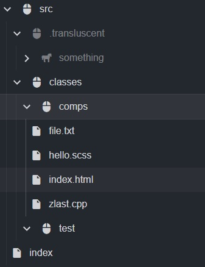

# Drawer

> Drawer is a front-end library for creating dynamic file explorers.



### Install
**NPM:**
```bash
npm install @kylehue/drawer
```
**CDN:**
```html
<!-- CSS -->
<link rel="stylesheet" href="https://cdn.jsdelivr.net/npm/@kylehue/drawer/build/styles/style.css">
<!-- JS -->
<script src="https://cdn.jsdelivr.net/npm/@kylehue/drawer/browser/Drawer.js"></script>
```

### Usage
```ts
import { Drawer } from "@kylehue/drawer";

const drawer = new Drawer({
   element: document.querySelector("#drawer")
   /* ...options */
});

// Adding items
drawer.root.add("src/classes/comps/sample.txt");

// Deleting items
drawer.root.delete("/src/classes/comps");

// Moving items
drawer.root.get("src/classes")?.move("/");

// Listen on item add
drawer.onDidAddItem((desc) => {
   console.log(desc.item.source + " has been added!");
});

// Listen on error
drawer.onError((error) => {
   console.error(error.reason);
});
```